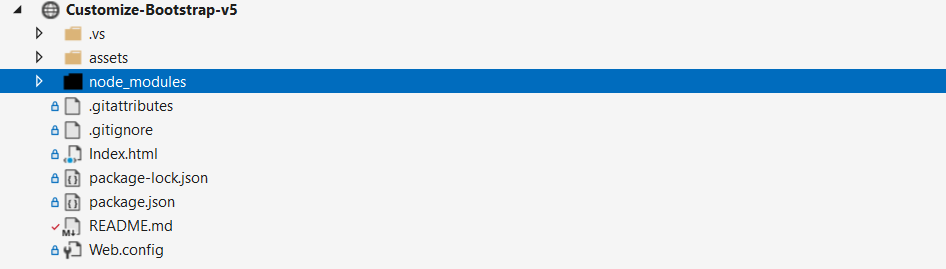

<h1>راهنمای سریع کار با پروژه TehranIT Web</h1>
<h2>نصب پکیج‌ها</h2>

اگر از همین ریپو استفاده می‌کنید و node_modules را دارید، این مرحله لازم نیست. و در غیر اینصورت ترمینال را باز کنید و بزنید:

<code>npm install bootstrap sass</code>

**مرحله یک نصب پکیج‌ها **
اگر میخواهید از این پروژه استفاده کنید نیازی به اجرای این بخش نیست. ترمینال رو باز کن و این رو بز. بعد از نصب، بوت‌استرپ داخل پوشه node_modules/bootstrap قرار می‌گیره
'npm install bootstrap sass'
**مرحله دوم بیلد کردن**
بعد از هر تغییر میتوانید توسط دستور زیر خروجی بگیرید از sass
npx sass .\assets\scss\app.scss .\assets\css\bootstrap-custom.min.css --style=compressed
اضافه‌کردن رنگ‌های سفارشی
رنگ را در assets/scss/custom/_variables.scss  تعریف کن. و در نقشه‌ی تم assets/scss/app.scss  اضافه کن.
تغییر رنگ و افزودن تم
این پروژه برای سفارشی‌سازی Bootstrap 5 با Sass و اضافه‌کردن تم‌های رنگی (Light/Dark/سفارشی) آماده شده است. کافی است در assets/scss/custom/_themes.scss برای هر تم، رنگ‌ها را ست کنی و با data-bs-theme سوییچ کنی.
برای رنگ های سفارشی که خود اضافه کرده اید باید دو حالت آن را وارد کنید. یعنی به صورت RGB و Hex
    --bs-dahua: #0f172a;
    --bs-dahua-rgb: 15,23,42; 
س

